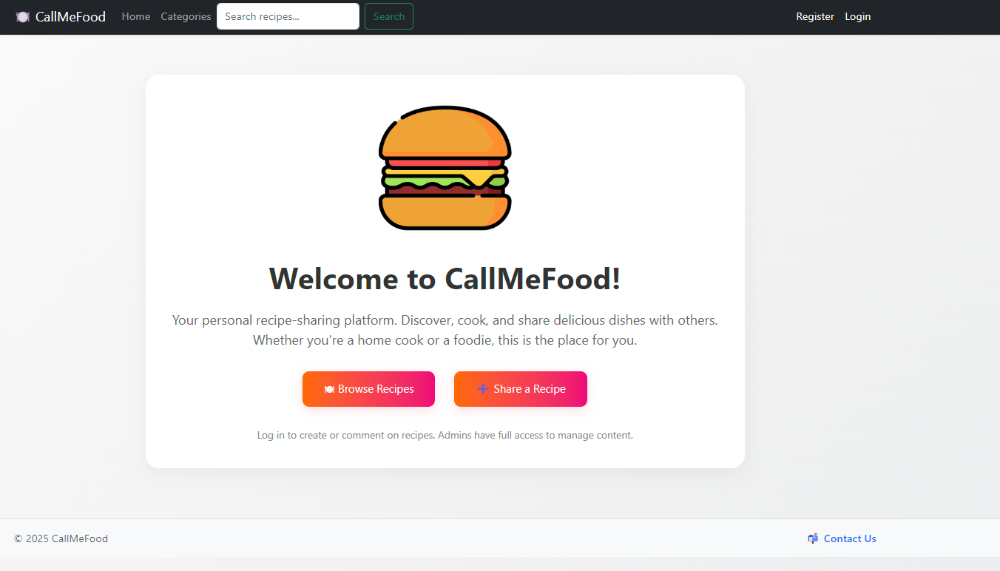
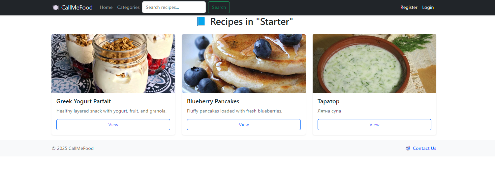
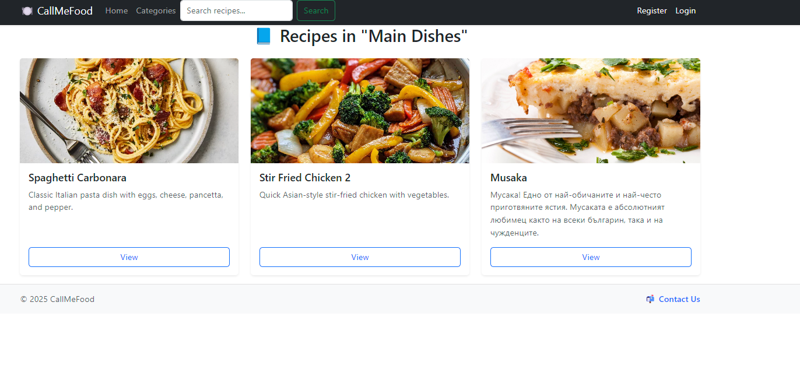

# 🍔 CallMeFood

**CallMeFood** is an ASP.NET MVC recipe-sharing web application built on .NET 8.0. It allows users to discover, create, and share recipes organised by category, with role-based access control for regular users and administrators.

---

## 📸 Screenshots

### Home Page


### Recipes by Category — Starters


### Recipes by Category — Main Dishes


---

## ✨ Features

- **Browse Recipes** — Explore recipes organised by category (Starters, Main Dishes, etc.)
- **Search** — Find recipes quickly via the search bar
- **Share a Recipe** — Authenticated users can submit their own recipes
- **Category Filtering** — Navigate recipes by category via the Categories menu
- **User Authentication** — Register and log in to unlock full functionality
- **Role-Based Access** — Admins have full content management capabilities
- **Multilingual Content** — Supports recipes in multiple languages (e.g., Bulgarian, English)
- **Comments** — Logged-in users can comment on recipes
- **Contact** — Users can reach the platform team via the Contact Us link

---

## 🛠️ Tech Stack

| Layer | Technology |
|---|---|
| Framework | ASP.NET MVC (.NET 8.0) |
| Language | C# |
| Frontend | HTML, CSS, JavaScript |
| Database | Entity Framework Core |
| Auth | ASP.NET Identity |

---

## 🚀 Getting Started

### Prerequisites

- .NET 8.0 SDK
- SQL Server (or LocalDB)
- Visual Studio 2022 / Rider / VS Code

### Installation

```bash
# Clone the repository
git clone https://github.com/natrapNiko/CallMeFood.git
cd CallMeFood

# Restore NuGet packages
dotnet restore

# Apply database migrations
dotnet ef database update

# Run the application
dotnet run --project CallMeFood
```

Open your browser at `https://localhost:5001`.

---

## 📁 Project Structure

```
CallMeFood/
├── CallMeFood/              # Main MVC web project
├── CallMeFood.Common/       # Shared constants & helpers
├── CallMeFood.Data/         # DbContext & migrations
├── CallMeFood.Data.Models/  # Entity models
├── CallMeFood.Services/     # Business logic layer
├── CallMeFood.ViewModels/   # View model DTOs
├── CallMeFood.Tests/        # Unit tests
├── screenshot1.png
├── screenshot2.png
├── screenshot3.png
└── README.md
```

---

## 👤 Author

**Nikolay Natrap**  
GitHub: [@natrapNiko](https://github.com/natrapNiko)

---

## 📄 Licence

This project was developed for academic/defence purposes.

---

*© 2025 CallMeFood*
